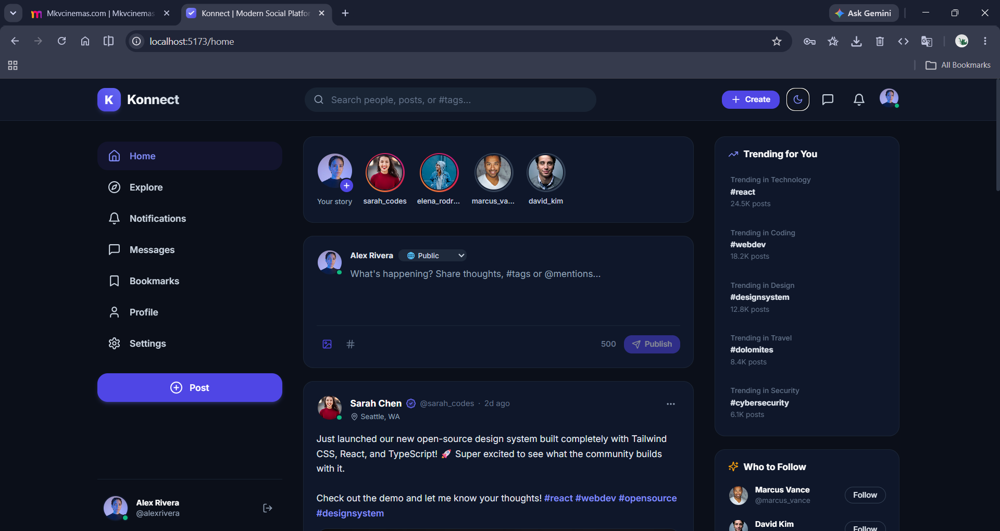
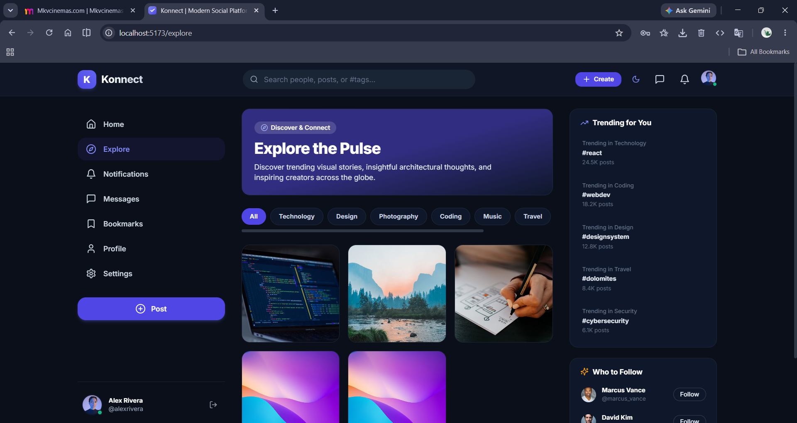
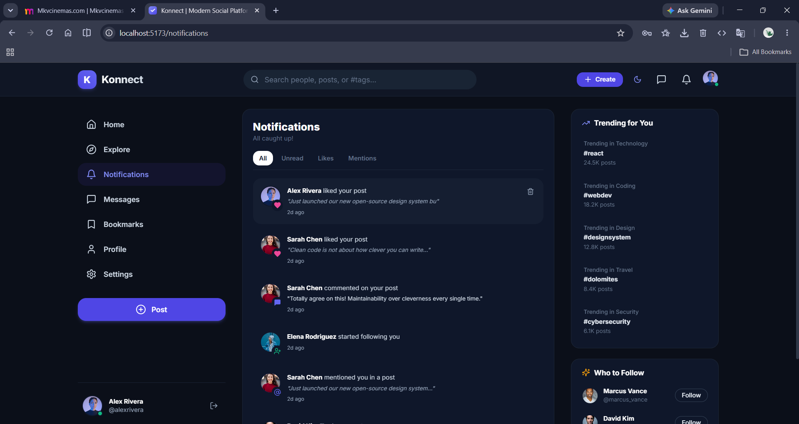
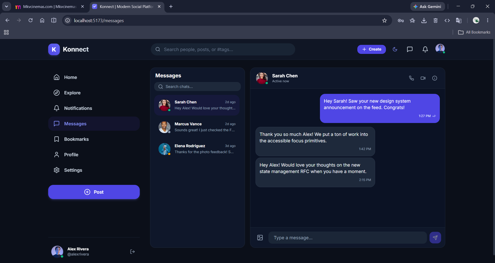
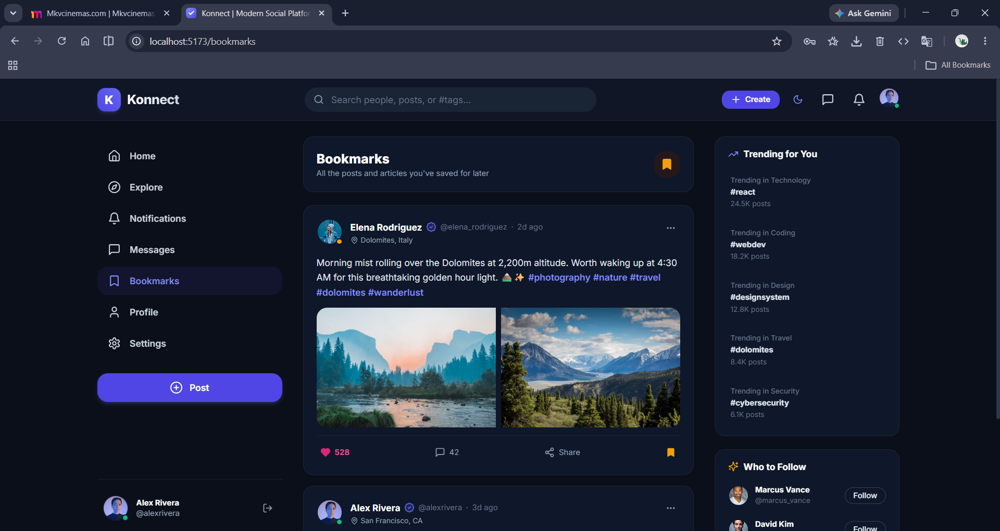
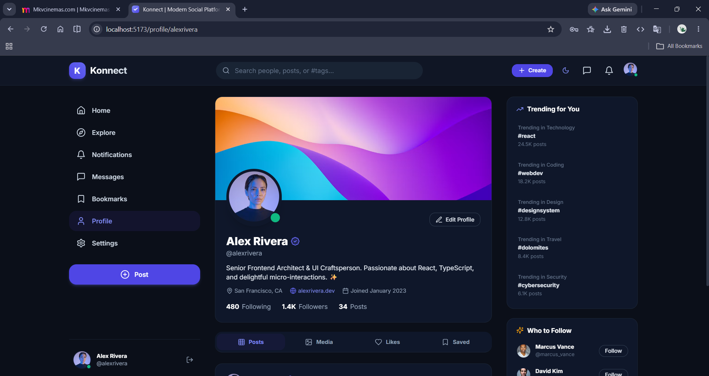
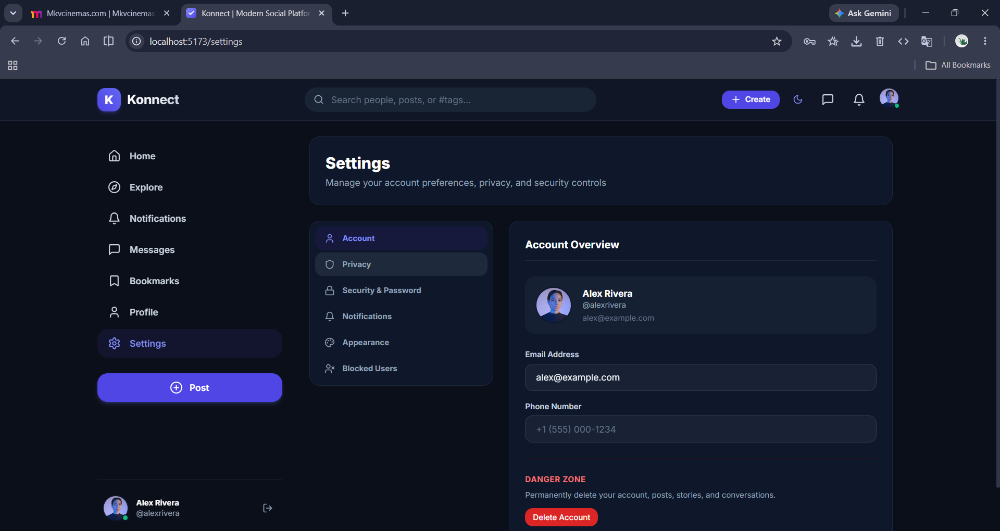

# Pulse — Modern Production-Ready Social Media Web Application

Pulse is a modern, modular, responsive, accessible, and high-performance social media web application built with **React, Vite, TypeScript, Tailwind CSS, React Router v6, React Hook Form, Zod, Lucide React, and Vitest**.

---
## Preview








## Demo
[▶️Demo](assets/konnect.mp4)

## 🌟 Key Features

### 1. 🔐 Complete Authentication Suite
- **Registration & Login**: Secure validation via **Zod** & **React Hook Form** with real-time feedback.
- **Demo Autofill Buttons**: Instant 1-click test credentials for multiple pre-seeded roles (`Alex Rivera`, `Sarah Chen`, `Elena Rodriguez`).
- **Password Recovery & Verification**: Forgot password flow, reset password token handling, and email verification screen.
- **Persistent Auth & Route Guards**: Protected (`ProtectedRoute`) and public (`PublicRoute`) route wrappers with localStorage session recovery.

### 2. 📰 Home Feed & Rich Post Creation
- **Feed Stream**: Infinite scrolling simulation with skeleton placeholders and empty states.
- **Rich Post Composer**: Text formatting, character counter, single and multi-image attachment previews, hashtag pills, user mentions, and privacy/visibility selectors.
- **Interactive Post Cards**:
  - Auto-linked clickable hashtags (`#tag` navigates to `/explore?tag=tag`) and mentions (`@username` navigates to `/profile/username`).
  - Like button with micro-pop keyframe animation & optimistic UI updates.
  - Expandable nested comment threads with inline reply boxes and like counters.
  - Share functionality (native mobile share sheet or clipboard copy with toast confirmation).
  - Bookmark post (instantly adds to Bookmarks).
  - Post options context menu: Edit post (modal), Delete post (confirmation dialog), Report post (modal), and Copy link.

### 3. 📸 Stories Carousel & Viewer
- **Story Tray**: Feed-top carousel with colorful gradient rings for active stories and muted rings for viewed stories.
- **Story Viewer**: Instagram/Snapchat-style full-screen viewer with segmented 5-second progress bars, auto-advance, touch hold to pause, next/previous buttons, and quick story replies.
- **Story Creator**: Modal to select preset photography or enter custom URLs with live caption preview.

### 4. 💬 Real-Time Direct Messaging
- **Responsive Split View**: Side-by-side conversation list & chat stream on desktop; fluid single-view transition on mobile.
- **Chat Features**: Read receipts (double ticks), message timestamps, media attachments, and auto-scroll.
- **Simulated Real-Time Layer**: Interactive socket pub/sub engine with automated bot responses and typing indicators (`"Sarah is typing..."`).

### 5. 🔍 Global Search & Explore
- **Global Search**: Debounced live input with filter tabs (`Top`, `People`, `Posts`, `Hashtags`) and recent search history saved to localStorage.
- **Explore Hub**: Curated category chips (`Technology`, `Design`, `Photography`, `Coding`, `Music`, `Travel`, `Gaming`), trending hashtags, and responsive masonry media grid.

### 6. 👤 User Profiles & Follow System
- **Profile Header**: Custom avatar & cover photo, verified badges, bio, location, website link, and joined date.
- **Follow System**: Optimistic Follow/Unfollow toggle button, follower & following counts with clickable modal lists.
- **Profile Tabs**: View user's `Posts`, `Media` grid, `Likes`, and `Saved` bookmarks.
- **Edit Profile**: Modal to update name, username, bio, location, website, avatar, and cover image.

### 7. 🔔 Notifications Center
- Comprehensive notification center with filter tabs (`All`, `Unread`, `Likes`, `Mentions`).
- Mark individual/all as read, quick deletion, and unread indicator badge in header.

### 8. ⚙️ Settings Suite
- **Account**: User details and permanent account deletion danger zone.
- **Privacy**: Private account toggle, activity status visibility, and story sharing permissions.
- **Security**: Password change form, 2FA toggle, and active session controls.
- **Notifications**: Granular toggles for email, push, likes, and comment alerts.
- **Appearance**: Dark Mode, Light Mode, and System preference synchronization.
- **Blocked Users**: List of blocked accounts with instant unblock action.

---

## 🛠️ Technology Stack

| Layer | Technology |
|---|---|
| **Core Framework** | React 18+ / React 19 (TypeScript) |
| **Build & Dev Tool** | Vite |
| **Routing** | React Router v6 (`createBrowserRouter` / `RouterProvider`) |
| **Styling** | Tailwind CSS with CSS Variables & Glassmorphism |
| **Forms & Validation** | React Hook Form + Zod Schema Validation |
| **Icons** | Lucide React |
| **API Client** | Axios (with request/response interceptors & mock fallback) |
| **Testing** | Vitest + React Testing Library + jsdom |

---

## 📁 Project Structure

```text
social-media-app/
├── public/
│   └── favicon.svg
├── src/
│   ├── components/
│   │   ├── common/             # Button, Input, Modal, Avatar, Loader, Skeleton, EmptyState, Toast
│   │   ├── layout/             # Header, Sidebar, RightSidebar, BottomNavigation
│   │   ├── post/               # PostCard, PostActions, PostMenu, PostMedia, CreatePost, EditPostModal, ReportModal
│   │   ├── comment/            # CommentItem, CommentList, CommentForm
│   │   ├── story/              # StoryList, StoryViewer, CreateStoryModal
│   │   ├── profile/            # ProfileHeader, ProfileTabs, EditProfileModal, FollowersModal
│   │   ├── messaging/          # ConversationList, ConversationItem, ChatWindow, MessageBubble, MessageInput
│   │   └── notification/       # NotificationItem, NotificationList
│   ├── pages/
│   │   ├── auth/               # Login, Register, ForgotPassword, ResetPassword, VerifyEmail
│   │   ├── Home/               # Main social feed & story tray
│   │   ├── Explore/            # Trending topics & media exploration
│   │   ├── Search/             # Debounced search across people, posts, and tags
│   │   ├── Profile/            # User profile view & tabs
│   │   ├── Messages/           # Direct real-time messaging
│   │   ├── Notifications/      # Notification center
│   │   ├── Bookmarks/          # Saved posts feed
│   │   ├── Settings/           # Account, privacy, appearance, and security settings
│   │   └── NotFound/           # 404 error page
│   ├── layouts/
│   │   ├── AppLayout.tsx       # 3-column responsive desktop & mobile shell
│   │   └── AuthLayout.tsx      # Split branding & form layout
│   ├── routes/
│   │   ├── AppRoutes.tsx       # Lazy-loaded route map
│   │   ├── ProtectedRoute.tsx  # Authenticated route guard
│   │   └── PublicRoute.tsx     # Guest route guard
│   ├── hooks/                  # useAuth, usePosts, useComments, useProfile, useMessages, useNotifications, useDebounce, useInfiniteScroll
│   ├── context/                # AuthContext, ThemeContext, SocketContext, ToastContext
│   ├── services/
│   │   ├── api/                # axios client, authApi, postApi, userApi, commentApi, messageApi, notificationApi, storyApi
│   │   ├── mock/               # mockData (rich seed), mockService (CRUD with localStorage & latency)
│   │   └── socket/             # socket event emitter & simulator
│   ├── schemas/                # authSchema, postSchema, commentSchema, profileSchema
│   ├── utils/                  # constants, storage, formatDate, helpers
│   ├── styles/                 # globals.css, components.css
│   ├── types/                  # index.ts (TypeScript interfaces)
│   ├── test/                   # setup.ts and test suites
│   ├── App.tsx
│   └── main.tsx
├── .env.example
├── package.json
├── tailwind.config.js
├── tsconfig.json
├── vite.config.ts
└── README.md
```

---

## 🚀 Getting Started

### 1. Installation

Clone or open the directory and install dependencies:

```bash
npm install
```

### 2. Running Locally

Start the Vite development server:

```bash
npm run dev
```

Open your browser at `http://localhost:5173`.

### 3. Running Test Suites

Execute the Vitest automated test suite:

```bash
npm test
```

### 4. Building for Production

Compile TypeScript and build the production bundle:

```bash
npm run build
```

---

## 🔑 Demo Credentials

For instant testing, pre-seeded accounts are provided on the Login page with 1-click fill buttons:

* **Alex Rivera (Senior Architect)**: `alex@example.com` / `password123`
* **Sarah Chen (Full Stack Engineer)**: `sarah@example.com` / `password123`
* **Elena Rodriguez (Photographer)**: `elena@example.com` / `password123`
* **Marcus Vance (Product Designer)**: `marcus@example.com` / `password123`

---

## 🔌 Connecting to a Real Backend

The app is built with a decoupled API layer. To connect to your real REST / GraphQL backend:

1. Update `.env`:
   ```env
   VITE_API_BASE_URL=https://api.yourdomain.com/api
   VITE_SOCKET_URL=https://api.yourdomain.com
   VITE_USE_MOCK_API=false
   ```
2. The Axios service in `src/services/api/axios.ts` automatically attaches `Authorization: Bearer <token>` to all requests and handles global 401 token invalidation.
